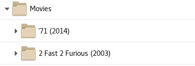

# Corionis ELS : Entertainment Library Synchronizer

Entertainment Library Synchronizer (ELS) Version 4 is a purpose-built tool
for preparing, managing and backing-up media for creators of all kinds
and applications such as home media systems.

If you create for YouTube, TikTok, Instagram, Mom 'n Dad managing your work
and backing it up is important. ELS is a library- and title-oriented tool with
both graphical and command line interfaces and a variety of powerful capabilities.

* Started in 2015 as a command line back-up tool for home media systems version 4.0
  adds a full-featured desktop application [screenshots].

* Views a collection of libraries spanning multiple storage devices the same way modern
  media systems do - on a logical library basis such as movies, TV shows, video segments,
  pictures, and audio.

* Has several modes of operation including the Navigator desktop application, new in
  version 4, and several command-line automation modes to provide a wide variety of capabilities.

* Is not specific to any system. Runs on Windows, Linux and Mac. Any modern 
  media system using the standard directory structure is supported.

The Navigator presents a workstation/collection and a back-up collection
in split-pane file browsers. Tools for creating and maintaining collection
content, tool automation in jobs, and back-up tool and collection
meta-data file editing are included.

The back-up tool may be run from the command line or scheduled using
standard operating system tools.

One or more local or LAN/Internet-connected back-ups are supported. All
communication is encrypted.

It's all built-in and free.

## Features

**Note:** Version 4.0 is a work in progress. These are the planned features. Until this
notice is removed there is no guarantee what works or has been completed, or even
what *will be completed*. Also "Done" means code complete. Bugs are *entirely possible*.

See the [Changelist](https://htmlpreview.github.io/?https://github.com/Corionis/ELS/blob/Version-4.0.0/deploy/changes.html):link: for
a list of the most recent changes in the developmental download files in the
[deploy](https://github.com/Corionis/ELS/blob/Version-4.0.0/deploy/) directory.

See the [Developer](https://github.com/Corionis/ELS/blob/Version-4.0.0/artifacts/document/developer.md)
notes in the Version-4.0.0 branch for information on how to run the Navigator. Pre-built Jars are available.

See the [Release Notes](https://github.com/Corionis/ELS/blob/Version-4.0.0/artifacts/document/release-notes.md)
in the Version-4.0.0 branch for on-going change information.

 * ELS Navigator added in version 4.0 is a powerful cross-platform desktop GUI application. It
   is an ELS-smart, purpose-built, interactive tool designed to make building and curating
   a media collection easier. 
   * Another mode of operation (-n | --navigator) in addition to all prior ELS functionality.
   * Done: Navigator Browser tab shows publisher and subscriber collections and local
     storage on each, similar to Filezilla but also ELS-smart.
     * Done: Drag and Drop, and Copy/Cut/Paste supported.
     * Done: Automatic multiple-storage free space roll-over of a drop or paste on an ELS library.
   * Done: Works with local or remote subscriber.
     * Done: When in listener mode ELS may also be accessed with a standard SFTP tool such as Filezilla.
   * Done: Optional automatic ELS Hint creation based on actions.
   * Done: Various purpose-built tools for curating a media collection.
     * Done: Duplicate Finder
     * Done: Empty Directory Finder
     * Done: Junk Remover
     * Done: Renamer
   * Done: Tools may be combined into jobs.
     * Done: Creation of command line to execute jobs. Useful for Linux
       cron jobs or Windows Task Scheduler tasks.
     * Done: Jobs may include other Jobs.
   * Done: Jobs may be executed from the command line 
   * External tools supported.
   * Done: Navigator Operations tool is for creation of ELS back-up tools that may be combined into jobs.
   * Done: Navigator Libraries tab is for editing of publisher, subscriber, 
     and hint management JSON files.
   * Done: Secure remote operation. End-point cross authentication, all communication is encrypted.
   * Add an inetd option for listener configurations so they may be started dynamically on-demand.
   * Fully internationalized - **translations requested**.
   * Done: Embedded JRE.
   * Windows installer.
   * Done: Linux install packages.
   * Built-in updater.
   * Cool new modern web site.
   * ELS will always be free. A donation button on the web site(s) will be added eventually.
   * Please use the Discussions. Feedback, ideas and code contributors are encouraged.
     * Be kind. There is one person working on this part-time as available.
 ---
 * ELS Hint Status Tracker to coordinate local hint status, new in 3.1.0.
 * ELS Hint Status Server to corrdinate remote hint status, new in 3.1.0.
 * ELS Hints to coordinate manual changes, new in 3.0.0.

 * Supports movies, television shows with season subdirectories, 
   music with artists and albums, etc.
 * Supports any mix of storage devices of different sizes.
 * Optionally copies new files to an existing movie or TV show if space is 
   available (back-fill).
 * Multiple targets may be defined for each library, e.g. movies. As 
   one reaches a minimum available space the next target is used (automatic roll-over).
 * Optionally generates a What's New text file of what items were copied.
 * Optionally generates a Mismatches text file of the detailed differences between the publisher and subscriber.
 * Stand-alone and client/server modes of operation are supported.
 * An interactive terminal is available for both publisher and subscriber.
 * Standard SFTP such as [Filezilla](https://filezilla-project.org/) may interactively connect to ELS when in listener mode.
 * May be scheduled using operating system tools, e.g. Windows Task Scheduler or Linux cron.
 * Nothing is added, no overhead except when using hints.
 * Runs on Windows, Linux and Mac.

ELS relies on a common directory structure used by modern home media
systems such as [Plex Media Server](https://plex.tv). Each media type,
such as a movie or television show, is contained in a unique directory
within a library directory.

For example:

ELS uses two JSON files to describe the bibliographies of one or more
libraries spread across multiple hard drives, one for the media system
and the other for the backup.

Another JSON file describes the target location(s) for new content. Each
library may have multiple targets for automatic roll-over. When a target
reaches a specified minimum amount of free space the next target is
used.

An add-on tool is available to generate a basic ELS JSON file from a
[Plex Media Server](https://www.plex.tv), see the [ELS Plex
Generator](https://github.com/Corionis/ELS-Plex-Generator). However ELS
will support any modern media system that uses the same directory structure.

ELS can run locally with attached storage devices as a single process or
over a LAN or the Internet using two computers running ELS with built-in
communications options.

This software is written in Java and operates on Windows, Linux, and
Apple systems. The media system and back-up do not have to be the same
type.

See the **[ELS Wiki](https://github.com/Corionis/ELS/wiki)** for
features, downloads and documentation.
