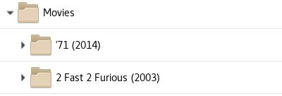

# ELS - Entertainment Library Synchronizer

Entertainment Library Synchronizer is a media back-up tool that synchronizes
a set of hard drive(s) with another set of hard drive(s) where the locations
of files are different on the two sets.

ELS uses a common directory structure used by modern home media systems such
as [Plex](https://plex.tv). Each item must be contained in a unique directory
within a library directory and that directory is described in a library.

For example:

 

ELS uses two JSON files to describe the bibliographies of one or more libraries
spread across multiple hard drives. Another JSON file describes the target
location(s) for new content.
 
This software is written in Java and operates on Windows, Linux, and Apple systems.

See the [ELS Wiki](https://github.com/GrokSoft/ELS/wiki) for details and downloads.
