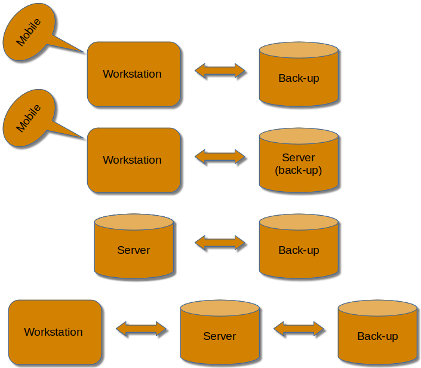
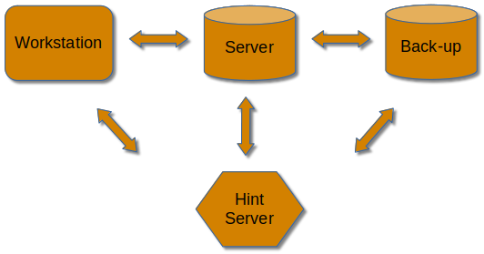

# Features

Entertainment Library Synchronizer (ELS) has a variety of basic and advanced features
and can work in a variety of ways.

## General

 * ELS is both a desktop application, the Navigator, and a command line tool.

 * Views a collection as a set of logical libraries and titles that may span multiple storage devices.

 * ELS Navigator may be used on:
   * A workstation for creating new content & collecting mobile media.
   * A data/media server, e.g. Plex server.
   * A back-up for either a workstation or server.
   * Together these modes support a variety of scenarios.

   

 * ELS Navigator displays two collections, a publisher and a subscriber.
   * A publisher is a workstation or a data/media server.
   * A subscriber is a data/media server or a back-up.
   * Each has two tabs, one for the logical collection and another for the system the collection is located on.
   * Directories and files may copied, moved, deleted, renamed, etc.
   * Local files may be opened, viewed, played, etc. 
   * ELS command line may be used to execute back-ups and may be automated.

 * Built-in updater. 

## Advanced

### &bull; Operations

&nbsp;&nbsp;&nbsp;&nbsp;ELS uses a publisher/subscriber paradigm and can operate in a variety of ways.

 * Local Publisher
 * Remote Publisher
 * Subscriber Listener
 * Hint Status Server
 * Publisher Terminal
 * Publisher Listener
 * Subscriber Terminal
 * Hint Server force quit
 * Subsriber Listener force quit 

### &bull; Tools

&nbsp;&nbsp;&nbsp;&nbsp;Built-in Tools everyone needs.

 * Duplicate Finder
 * Empty Directory Finder
 * Junk Remover
 * Operations
 * Renamer
 * Sleep tool

### &bull; Jobs

&nbsp;&nbsp;&nbsp;&nbsp;Any number Jobs may be defined for manual or automated execution.

 * User-definable Jobs are a sequence of Tools put into Tasks.

### &bull; Security
 * Blacklist and whitelist to avoid hack attempts against listener Operations.

### &bull; Hints

&nbsp;&nbsp;&nbsp;&nbsp;Coordinate manual changes in collections.

 * Works locally or remotely:

   

 * Any number of back-ups are supported.

