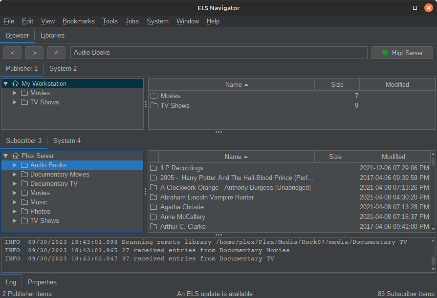

ELS Version 4

&nbsp;This site is under construction and incomplete&nbsp;

Entertainment Library Synchronizer (ELS) Version 4 is a purpose-built tool for preparing, managing and backing-up data and media for creators of all kinds and 
applications such as home media systems. ELS Version 4 is in development. The current released version is 3.1.0.

If you create for YouTube, TikTok, Instagram, Mom 'n Dad, or a media system like Plex managing your work and backing it up is important. ELS is a library- and 
title-oriented tool with both graphical and command line interfaces and a variety of powerful capabilities.

* Started in 2015 as a command line back-up tool for home media systems version 4.0 adds a full-featured desktop application.

* Views a collection of libraries spanning multiple storage devices the same way modern media systems do - on a logical library basis such as movies, TV shows, video segments,
  pictures, and audio.

* Has several modes of operation including the Navigator desktop application, new in version 4, and several command-line automation modes to provide a 
  wide variety of capabilities.

* Is not specific to any system. Runs on Windows, Linux and Mac. Any modern media system using the standard directory structure is supported.

* Works locally or remotely over a LAN or the Internet with two computers running ELS.

_ELS is Open Source and free._

 * ELS 4 is for computers. If you're viewing this page on a mobile device the Download and other links are hidden. Please visit the
<a href="{{ site.project_url }}" target="_blank"><b>ELS Project </b></a> 
on GitHub for more information.
