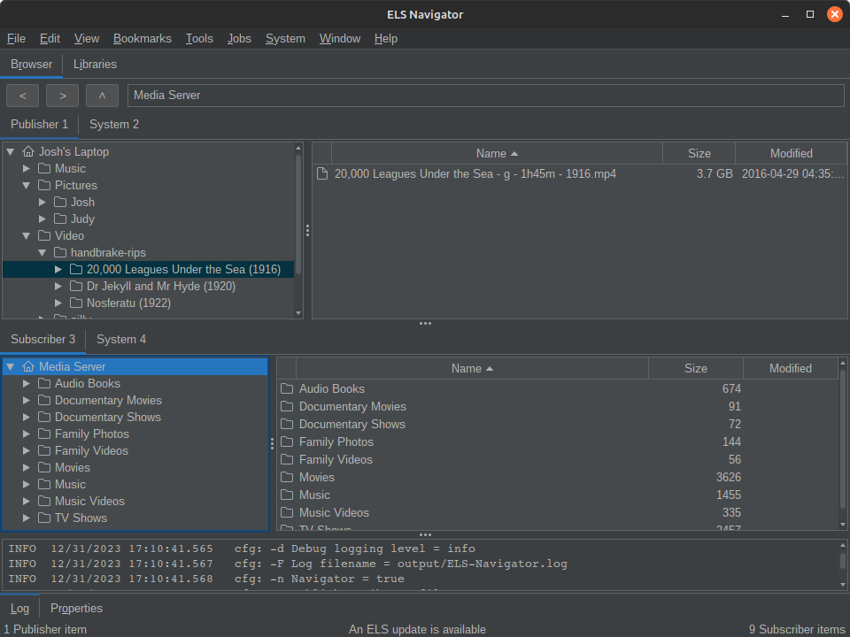

What Is ELS?

Entertainment Library Synchronizer (ELS) Version 4 is a purpose-built library and title oriented tool for managing and backing-up data
for creators of all kinds with expandable storage spanning multiple devices.

Any project with large amounts of data for YouTube, TikTok, Instagram, game development, science, or media systems such as Plex 
organizing and managing your work is important. And backing it up is critical. 

ELS is a tool with both graphical and command line interfaces and a wide variety of powerful capabilities.

 * Started in 2015 as a command line back-up tool for home media systems version 4.0 adds a full-featured desktop application.

 * Views a collection of libraries spanning multiple storage devices the same way modern media systems do - on a logical library basis 
   such as movies, TV shows, video segments, graphics, sound effects, etc.
   
   Works well for music compositions, graphics modeling, game projects, scientific data or large amounts of information 
   needing to be organized and backed-up.

 * Has several modes of operation including the Navigator desktop application, new in version 4, and several command-line automation modes to provide a 
  wide variety of capabilities.

 * Works locally or remotely over a LAN or the Internet with two computers running ELS.

 * Is not specific to any system. Runs on Windows, Linux and Mac. Any modern media system using the standard directory structure is supported.

 * See [<b>Features</b>](features.md) for more information.

The current release version is 3.1.0. 
ELS Version 4 is in development. See the project
<a href="{{ site.milestones_url }}" target="_blank"><b>Milestones </b></a>.

_ELS is Open Source and free._
